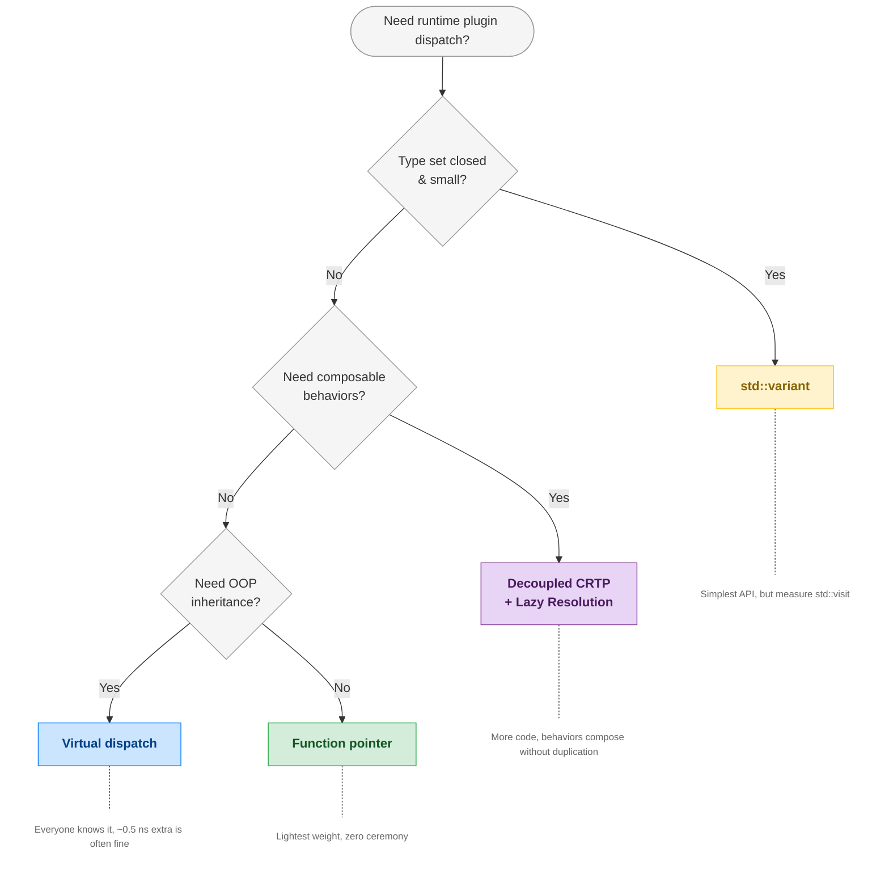

You're building a system with pluggable strategies. The user picks one at startup - a config flag, a command-line argument - and every call goes through that strategy. The call runs millions of times per second. How do you dispatch it?

This post compares four approaches to this problem using the same domain, the same API, and the same three plugins. We'll look at the generated assembly, measure dispatch overhead, and build a decision framework for picking the right one.

## The Scenario

Consider a garbage collector barrier system (borrowed from OpenJDK). A *barrier* is a small piece of bookkeeping that runs every time you write to the heap. Think of it as a hook that fires around every store, letting the GC track what changed. The user selects a GC algorithm at startup via a flag, and every memory write goes through the selected barrier (`store(addr, value)`), millions of times per second. There are three GC algorithms, each with different barrier logic:

- **Epsilon**: does nothing (no-op barrier, used for testing)
- **Serial**: adds a post-barrier after the store (records which memory regions were modified, so the GC knows where to look)
- **G1**: adds a pre-barrier before the store (saves the old value so the GC can process references correctly) *and* a post-barrier after it

We want three things:

1. **Runtime flexibility**: the user picks the strategy at startup
2. **Minimal dispatch overhead**: every nanosecond counts at 100M calls/sec
3. **Composability**: G1 needs pre + post barriers, Serial needs only post. Can we compose these instead of duplicating?

## Approach 1: Virtual Dispatch

The most familiar approach, an abstract base class with virtual methods:

```cpp
class BarrierSet {
public:
    virtual ~BarrierSet() = default;
    virtual void store(int* addr, int value) = 0;
};

class G1BarrierSet : public BarrierSet {
public:
    void store(int* addr, int value) override {
        // pre-barrier: save old value before overwriting
        printf("  [pre-barrier] saving old value: %d\n", *addr);
        // raw store
        *addr = value;
        // post-barrier: record which region was modified
        printf("  [post-barrier] recording modified region @ %p\n", addr);
    }
};

auto bs = BarrierSet::create(argv[1]);  // "g1", "serial", "epsilon"
bs->store(heap, 42);
```

Every C++ developer has written this. But what does the compiler generate?

```nasm
movq  (%rdi), %rax           ; LOAD 1: vptr from object
call  *16(%rax)              ; LOAD 2: vtable entry → indirect call
```
[See it on Compiler Explorer →](https://godbolt.org/z/eYqqGvrK1)

Two dependent memory loads before the call. The `this` pointer occupies `%rdi`, and the compiler cannot inline across the virtual boundary. Each GC also duplicates the full barrier logic. G1 and Serial both implement the raw store and post-barrier independently.

## Approach 2: Function Pointer

Strip away the class hierarchy entirely:

```cpp
void epsilon_store(int* addr, int value) {
    *addr = value;
}

void g1_store(int* addr, int value) {
    printf("  [pre-barrier] saving old value: %d\n", *addr);
    *addr = value;
    printf("  [post-barrier] recording modified region @ %p\n", addr);
}

using StoreFn = void(*)(int*, int);
StoreFn store = resolve(argv[1]);  // returns the right function pointer
store(heap, 42);
```

There's no class hierarchy here and no `this` pointer, just a raw function address. The assembly:

```nasm
call  *%r12                  ; indirect call through register
```
[See it on Compiler Explorer →](https://godbolt.org/z/bEWhMc7ra)

One indirect call. The pointer lives in a callee-saved register, so there's no memory load at all, just the indirect branch. Arguments go directly in `%rdi` and `%rsi` without the `this` pointer overhead.

But like virtual dispatch, each function reimplements the full barrier logic. No composition.

## Approach 3: std::variant + std::visit

The modern C++ approach, a closed type set with compiler-generated dispatch:

```cpp
using AnyBarrierSet = std::variant<EpsilonBarrierSet, SerialBarrierSet, G1BarrierSet>;

auto bs = create(argv[1]);
std::visit([&](auto& b) { b.store(addr, value); }, bs);
```

There's no base class and no vtable, and the compiler can see all the types. So what does it generate?

Here's what libstdc++ (GCC 11) actually produces:

```nasm
movq  %rbp, 16(%rsp)        ; STORE 1: spill to lambda capture
movq  %r13, 24(%rsp)        ; STORE 2: spill to lambda capture
movzbl 7(%rsp), %eax        ; load variant index
call  *(%r14,%rax,8)        ; indexed indirect call into _S_vtable
```
[See it on Compiler Explorer →](https://godbolt.org/z/f1T14Pdbx)

libstdc++ generates **its own function pointer table** (`_S_vtable`), essentially a vtable. On top of that, there are two stack stores per call to build the lambda capture struct that the visited function reads back.

It's a vtable with extra steps. More overhead than virtual dispatch, not less.

> **Caveat:** This is a libstdc++ implementation quality issue. libc++ or MSVC may generate different code. Always measure with your toolchain.

The extensibility story is also worse: adding a new GC means modifying the `variant` typedef, which touches every file that uses it. The type set is closed by definition.

## Approach 4: Decoupled CRTP + Lazy Resolution

The first instinct for compile-time polymorphism is conventional CRTP:

```cpp
template <typename Derived>
class BarrierSet {
    void store(int* addr, int value) {
        static_cast<Derived*>(this)->do_store(addr, value);
    }
};

class G1BarrierSet : public BarrierSet<G1BarrierSet> { ... };
```

This gives you static dispatch - no vtable, but it has two fundamental problems. First, the base class must know the derived type at compile time. When the user picks the GC at runtime, you can't write `BarrierSet<???>`. Second, you can't have a static or global `BarrierSet*` singleton without baking the derived type into the base. The type parameter infects everything. Conventional CRTP is out.

### Decoupled CRTP: Flip the Relationship

Decoupled CRTP solves this by moving the template connection *inside* the base class. Instead of `class BarrierSet<Derived>`, you nest a templated inner class:

```cpp
class BarrierSet {
    static BarrierSet* _barrier_set;  // set once at startup, used forever

    // Base compiles independently - no template parameter, no Derived type
    template <typename BarrierSetT>
    class AccessBarrier {
        static void store(int* addr, int value) {
            static_cast<BarrierSetT*>(_barrier_set)->do_store(addr, value);
        }
    };
};
```

Notice that the base class compiles without knowing any concrete GC type. It can hold a static singleton member (`BarrierSet* _barrier_set`) that points to whichever GC the user selected at startup, without the base itself being templated. The `AccessBarrier` inner class carries the CRTP connection: it implements the hot-path APIs and does the static cast. Each GC subclass provides its own `AccessBarrier` specialization that layers one concern on top of the parent's.

The template machinery generates code for *all* derived types at compile time: `G1BarrierSet::AccessBarrier<>::store`, `SerialBarrierSet::AccessBarrier<>::store`, `EpsilonBarrierSet::AccessBarrier<>::store` all exist in the binary. Lazy resolution then picks the correct one at runtime based on the user's flag, caches a function pointer to it, and every subsequent call goes direct.

The net effect: **we replace the vtable overhead on every call with a one-time initialization cost.** After that first resolution, the dispatch path is identical to a direct function pointer: no vptr load, no vtable lookup, just a single indirect call.

This is what [OpenJDK](https://github.com/openjdk/jdk/blob/master/src/hotspot/share/gc/shared/barrierSet.hpp) actually uses. Here's what it looks like with real barrier composition, where each GC subclass provides its own `AccessBarrier` that layers one concern on top:

```cpp
// Layer 0: raw write - the base concern
class BarrierSet {
    template <typename BarrierSetT>
    class AccessBarrier {
        static void store(int* addr, int value) { *addr = value; }
    };
};

// Layer 1: adds a post-barrier (records which region was modified)
class CardTableBarrierSet : public BarrierSet {
    template <typename BarrierSetT>
    class AccessBarrier : public BarrierSet::AccessBarrier<BarrierSetT> {
        static void store(int* addr, int value) {
            BarrierSet::AccessBarrier<BarrierSetT>::store(addr, value);  // delegate to parent: raw write
            record_modified_region(addr);                                // this layer's concern
        }
    };
};

// Layer 2: adds a pre-barrier (saves old value before overwriting)
class G1BarrierSet : public CardTableBarrierSet {
    template <typename BarrierSetT>
    class AccessBarrier : public CardTableBarrierSet::AccessBarrier<BarrierSetT> {
        static void store(int* addr, int value) {
            save_old_value(addr);                                              // this layer's concern
            CardTableBarrierSet::AccessBarrier<BarrierSetT>::store(addr, value); // delegate: raw + post
        }
    };
};
```

Each GC only adds its own concern, no duplication. The compiler sees through the template chain and generates the same code as if you'd hand-written each barrier combination. The templates are the source-level abstraction; they don't exist at runtime.

So now we have all the concrete implementations compiled and ready: `G1BarrierSet::AccessBarrier<>::store`, `SerialBarrierSet::AccessBarrier<>::store`, `EpsilonBarrierSet::AccessBarrier<>::store`. The last piece: how do we pick the right one when the user passes a flag at startup?

### Lazy Resolution (Resolve Once, Dispatch Forever)

The function pointer starts at `&store_init`. The first call resolves the runtime choice and patches the pointer:

```cpp
struct RuntimeDispatch {
    using StoreFn = void(*)(int*, int);
    static StoreFn _store_func;   // starts at &store_init

    static void store_init(int* addr, int value) {
        StoreFn func;
        switch (BarrierSet::barrier_set()->kind()) {
            case G1:      func = &G1BarrierSet::AccessBarrier<>::store;      break;
            case Serial:  func = &SerialBarrierSet::AccessBarrier<>::store;  break;
            case Epsilon: func = &EpsilonBarrierSet::AccessBarrier<>::store; break;
        }
        _store_func = func;    // PATCH - future calls skip the switch
        func(addr, value);     // first call goes through
    }

    static void store(int* addr, int value) {
        _store_func(addr, value);   // after first call: single indirect call
    }
};
```

After the first call, the assembly is identical to the function pointer approach:

```nasm
call  *_store_func(%rip)     ; indirect call through global
```
[See it on Compiler Explorer →](https://godbolt.org/z/Y7voz9Ynx)

Same dispatch cost as a function pointer, but the target function is composed. Each barrier concern is layered, not duplicated.

One caveat worth noting: conventional CRTP also uses `static_cast`, but it casts `this`, which is always the correct derived type by construction. In decoupled CRTP, the cast targets a global singleton (`_barrier_set`) whose concrete type is a runtime decision. If the resolution switch pairs the wrong type with the wrong `AccessBarrier` instantiation, you get undefined behavior. The resolution logic must get this right. OpenJDK solves this with a lightweight type identity mechanism that avoids C++ RTTI entirely. More on that in a future post.

## Comparison

All measurements on an Intel Xeon Gold 6130 @ 2.10 GHz, 100M iterations with G1 barriers, compiled with GCC 11 at `-O2 -march=skylake-avx512`.

| | Virtual | FnPtr | variant | Decoupled CRTP |
|---|---|---|---|---|
| **Dispatch overhead** | +1.4 ns | +0.9 ns | +2.2 ns | +0.9 ns |
| **Binary size (text)** | 6.8 KB | 4.7 KB | 5.2 KB | 7.9 KB |
| **Compile time** | 0.38s | 0.25s | 0.32s | 0.29s |
| **Lines of code** | 90 | 65 | 76 | 346 |
| **Extensibility** | Open | Open | Closed | Open |
| **Composition** | Duplicated | Duplicated | Duplicated | Layered |
| **Error messages** | Clear | Clear | Moderate | Poor |
| **Debuggability** | Excellent | Good | Moderate | Moderate |

CRTP and function pointer tie at +0.9 ns, but CRTP is the only approach where barrier concerns compose instead of being duplicated. That composability comes at a price: 5x more code, the largest binary (+67%), and the steepest learning curve.

Variant is the slowest despite having no vtable. The overhead comes from libstdc++'s `std::visit`, which builds a lambda capture struct and indexes into its own function pointer table on every call. Adding a new type means modifying the variant typedef everywhere.

Virtual dispatch sits in the middle on almost every dimension. Most debuggable, easiest to understand, and the ~0.5 ns extra over a function pointer is rarely the bottleneck. For most codebases, this is the right default.

CRTP (0.29s) actually compiles faster than virtual (0.38s) despite 5x more code -- virtual needs full class definitions visible at every call site for vtable layout, while CRTP templates only instantiate what each translation unit needs. Function pointer is fastest (0.25s) with no class hierarchy and no templates.

## Decision Framework



## Key Takeaways

1. **All four work.** Pick based on constraints, not microbenchmark deltas.
2. **`std::variant + std::visit` is NOT always faster than virtual**. Check your stdlib implementation.
3. **The right question isn't "which is fastest?"** It's: do I need composition? decoupling? extensibility? Then pick the simplest approach that satisfies those.

---

*All four implementations, benchmarks, and build instructions are in the [companion repository](https://github.com/Shubhankar-Gambhir/cpp-dispatch-benchmark). Measured on Intel Xeon Gold 6130 @ 2.10 GHz, GCC 11, libstdc++, `-O2 -march=skylake-avx512`.*
