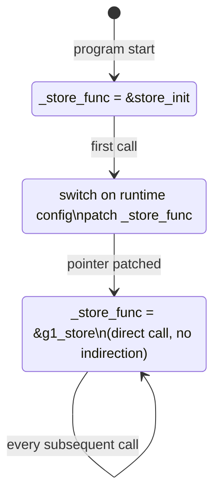
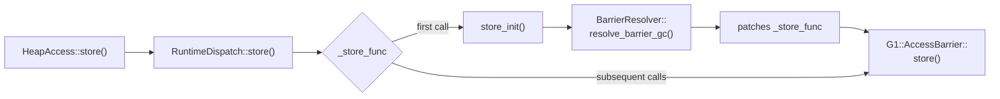

In the [previous post](https://shubhankar-gambhir.github.io/posts/four-ways-to-dispatch-a-runtime-selected-strategy-in-cpp/), decoupled CRTP with lazy resolution matched raw function pointers at +0.9 ns dispatch overhead. But I glossed over the interesting part: how lazy resolution actually works.

This post takes it apart. We'll walk through the three states of a self-patching function pointer, look at the assembly, measure the resolution cost, and map each piece to the actual OpenJDK source where this pattern originated.

## The Problem

You have a set of concrete implementations compiled at build time. Templates give you composition and inlining within each implementation. But the user picks which one to use at runtime, via a flag or config file.

The obvious solutions each have a cost on every call:

- **Virtual dispatch**: two dependent memory loads (vptr, then vtable entry)
- **Switch/if-else**: a branch on every invocation
- **`std::variant`**: libstdc++ builds a lambda capture struct and indexes into its own function pointer table

What if you could decide once and never pay again?

## The Pattern

The idea is simple. You have a function pointer that starts pointing at a resolver stub. The first call runs the resolver, which figures out the right implementation, patches the pointer to point directly at it, and forwards the call. Every subsequent call goes through the patched pointer, which is now a direct function call. No vtable, no branch, no switch.

Here's the minimal version:

```cpp
using StoreFn = void(*)(int*, int);

// Three concrete implementations
void epsilon_store(int* addr, int value) { *addr = value; }
void serial_store(int* addr, int value)  { *addr = value; sink = 1; }
void g1_store(int* addr, int value)      { sink = *addr; *addr = value; sink = 1; }

// Forward declaration
void store_init(int* addr, int value);

// The function pointer. Starts pointing at the resolver.
StoreFn _store_func = &store_init;

// Resolver: runs once, patches the pointer, forwards the call
void store_init(int* addr, int value) {
    StoreFn func;
    switch (runtime_gc_choice()) {
        case G1:      func = &g1_store;      break;
        case Serial:  func = &serial_store;  break;
        case Epsilon: func = &epsilon_store; break;
    }
    _store_func = func;    // patch
    func(addr, value);     // forward
}

// Public API
void store(int* addr, int value) {
    _store_func(addr, value);
}
```

## Three States of the Pointer

The function pointer goes through three states during the program's lifetime:



**State 1: Unresolved.** The pointer holds the address of `store_init`. No runtime choice has been made yet.

**State 2: Resolving.** The first call to `store()` invokes `store_init`. It reads the runtime configuration, picks the right implementation, writes the function address into `_store_func`, and then tail-calls the resolved function so the first invocation still gets the right answer.

**State 3: Resolved.** The pointer now holds the address of the concrete implementation (e.g., `&g1_store`). Every subsequent call is a single indirect call through a global. The resolver is never called again.

## What the Compiler Generates

After resolution, the `store()` function compiles down to:

```nasm
; store() - steady state
jmp   *_store_func(%rip)       ; tail-call through global function pointer
```

That's it. One instruction. The pointer lives at a fixed RIP-relative address, so there's no object dereference, no vptr load, no vtable indexing. Just a jump through a global.

Compare that to virtual dispatch:

```nasm
; virtual dispatch
movq  (%rdi), %rax             ; LOAD 1: vptr from object
call  *16(%rax)                ; LOAD 2: vtable entry → indirect call
```

Two dependent loads. The second can't start until the first completes.

The `store_init` resolver itself is straightforward:

```nasm
; store_init() - runs once
store_init:
    movq  g_gc_name(%rip), %rdi    ; load the config string
    call  resolve                   ; returns function address in %rax
    movq  %rax, _store_func(%rip)  ; PATCH the global pointer
    jmp   *%rax                    ; tail-call the resolved function
```

After `store_init` patches `_store_func`, it's never called again. The `jmp *%rax` at the end forwards the first call to the correct implementation without the caller knowing anything happened.

## Benchmarks

All measurements on the same hardware as the previous post. 100M iterations, G1 barriers, GCC 11 at `-O2 -march=native`. The new measurement here is the resolution cost (how long the first call takes when it triggers the resolver).

| | Resolution (first call) | Steady-state | Direct fnptr | Lazy overhead |
|---|---|---|---|---|
| **G1** | ~38 ns | 1.97 ns/call | 1.97 ns/call | ~0.00 ns |
| **Serial** | ~38 ns | 1.65 ns/call | 1.65 ns/call | ~0.00 ns |
| **Epsilon** | ~37 ns | 1.64 ns/call | 1.64 ns/call | ~0.00 ns |

The resolution cost is about 37-38 ns, and it happens exactly once. After that, lazy resolution is indistinguishable from a direct function pointer. The "lazy overhead" column is noise-level: at 100M iterations, the one-time 38 ns cost amortizes to 0.00038 ns per call.

For context, here's how it stacks up against all four approaches from the previous post (G1 barriers, same machine):

| Approach | Dispatch overhead |
|---|---|
| Direct call (baseline) | 0.68 ns |
| Function pointer | 1.68 ns |
| **Decoupled CRTP (lazy)** | **1.65 ns** |
| Virtual dispatch | 2.30 ns |
| `std::variant` + `std::visit` | 2.30 ns |

Lazy resolution matches function pointers in steady state, but it also gives you the composition that function pointers lack.

## How OpenJDK Does It

The pattern above is a simplified version of what [OpenJDK](https://github.com/openjdk/jdk/blob/master/src/hotspot/share/oops/accessBackend.hpp) uses for its GC barrier dispatch. Let's map the pieces side by side.

### The Resolver: `RuntimeDispatch`

In OpenJDK, the equivalent of our `_store_func` lives in the `RuntimeDispatch` template. It holds one function pointer per access type (load, store, CAS, etc.) and each starts pointing at a `xxx_init` method:

| Simplified version | OpenJDK |
|---|---|
| `StoreFn _store_func` | `RuntimeDispatch::_store_func` |
| `store_init()` | `RuntimeDispatch::store_init()` |
| `switch (kind)` | `BarrierResolver::resolve_barrier_gc()` |
| `_store_func = func` | patching in `xxx_init` |

The resolution switch in OpenJDK lives in `access.inline.hpp`, in a method called `resolve_barrier_gc`. It maps the runtime `BarrierSet::Name` enum to the correct `AccessBarrier` specialization, exactly like our switch:

```cpp
// OpenJDK: access.inline.hpp (simplified)
template <DecoratorSet decorators, typename BarrierSetT>
typename AccessFunction<decorators, T>::type
BarrierResolver::resolve_barrier_gc() {
    BarrierSet* bs = BarrierSet::barrier_set();
    switch (bs->kind()) {
        case BarrierSet::G1:
            return G1BarrierSet::AccessBarrier<decorators>::oop_store;
        case BarrierSet::CardTable:
            return CardTableBarrierSet::AccessBarrier<decorators>::oop_store;
        // ...
    }
}
```

### Type Identity: FakeRtti

One subtlety our simplified version skips: how does `resolve_barrier_gc` know what type the global singleton is? C++ RTTI (`dynamic_cast`) would work, but OpenJDK avoids it entirely. Instead, each `BarrierSet` carries a lightweight type identity based on a bitset:

```cpp
// OpenJDK: utilities/fakeRttiSupport.hpp (simplified)
template <typename T, typename TagType>
class FakeRttiSupport {
    uint32_t  tag_set_;       // bitset: which types this instance "is-a"
    TagType   concrete_tag_;  // the specific concrete type

    bool has_tag(TagType tag) const {
        return (tag_set_ & (1u << tag)) != 0;
    }
};
```

When a `G1BarrierSet` is created, it sets its concrete tag to `G1BS` and also adds `ModRefBS` and `BarrierSet` to its tag set. The `barrier_set_cast<T>()` helper asserts that the tag is present before doing a `static_cast`, catching mismatches at runtime without RTTI overhead:

```cpp
template <typename T>
T* barrier_set_cast(BarrierSet* bs) {
    assert(bs->is_a(BarrierSet::GetName<T>::value));
    return static_cast<T*>(bs);
}
```

This is cheaper than `dynamic_cast` (a bitwise AND vs. walking the type hierarchy) and works in codebases compiled with `-fno-rtti`.

### The Full Picture

Here's how all the pieces connect in OpenJDK:



The caller (`HeapAccess::store`) never changes. It always calls through `RuntimeDispatch::store`, which always calls through `_store_func`. The only thing that changes is what `_store_func` points to, and that changes exactly once.

## Thread Safety

In OpenJDK, this resolution happens during VM initialization, before any application threads start. The JVM is single-threaded at that point, so no synchronization is needed.

If you use this pattern in a general-purpose C++ codebase where multiple threads might hit the first call concurrently, you need to think about it. On x86, aligned pointer-sized writes are atomic at the hardware level, so you won't get a torn pointer. But the C++ memory model doesn't guarantee this.

The safe portable approach is `std::atomic<StoreFn>` with `memory_order_relaxed`:

```cpp
std::atomic<StoreFn> _store_func{&store_init};

void store(int* addr, int value) {
    _store_func.load(std::memory_order_relaxed)(addr, value);
}

void store_init(int* addr, int value) {
    StoreFn func = resolve();
    _store_func.store(func, std::memory_order_relaxed);
    func(addr, value);
}
```

`memory_order_relaxed` is enough here because we don't need ordering guarantees between threads. If two threads race to resolve, they'll both compute the same answer (the GC choice is immutable after startup) and both write the same pointer. The worst case is that the resolver runs twice, which is harmless.

## When to Use This

Lazy resolution works well when:

- **The choice is made once and never changes.** GC selection, logging backend, rendering pipeline. If the strategy could change mid-execution, you need something else.
- **The call is on a hot path.** If you're calling this 100M times per second, the difference between one indirect call and two dependent loads (virtual dispatch) matters. If you're calling it once per request, use virtual dispatch.
- **You want composition.** This is what separates it from raw function pointers. The resolved function can be the endpoint of a template inheritance chain that composes concerns at compile time.

It's overkill when:

- **You need per-object dispatch.** Lazy resolution works on globals/singletons. If different objects need different strategies, virtual dispatch is the right tool.
- **The strategy set changes at runtime.** Plugin systems where users can load new strategies dynamically need a different pattern.

If you think about it, this is the same idea behind PLT (Procedure Linkage Table) stubs in ELF dynamic linking. The first call to a dynamically linked function goes through a stub that resolves the symbol and patches the GOT entry. Every subsequent call goes direct. Lazy resolution applies the same principle at the application level.

## Key Takeaways

1. **Lazy resolution trades one-time startup cost (~38 ns) for zero per-call overhead.** After resolution, it's indistinguishable from a direct function pointer.
2. **The pattern has three moving parts**: a function pointer, a resolver stub, and a patch. The resolver runs once and then gets out of the way.
3. **Combined with decoupled CRTP**, lazy resolution gives you both composition (template inheritance chains) and zero-overhead dispatch. That's the combination that makes it compelling over raw function pointers.
4. **OpenJDK has used this pattern since JDK 10** for GC barrier dispatch. The production implementation adds FakeRtti for type safety without C++ RTTI overhead.

---

*The benchmark code and all examples are in the [companion repository](https://github.com/Shubhankar-Gambhir/cpp-dispatch-benchmark). Measured on Intel Xeon Gold 6130 @ 2.10 GHz, GCC 11, libstdc++, `-O2 -march=native`.*