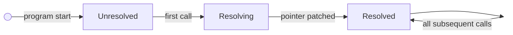
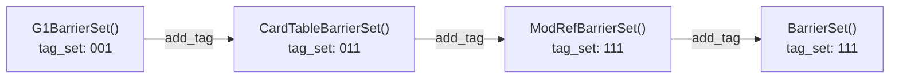
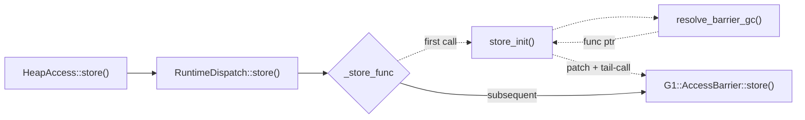

What if a function pointer could resolve itself on first use, then dispatch at zero cost forever after?

In a [previous post](https://shubhankar-gambhir.github.io/posts/four-ways-to-dispatch-a-runtime-selected-strategy-in-cpp/), I compared four approaches to runtime dispatch in C++: virtual functions, function pointers, `std::variant`, and a template-based technique called decoupled CRTP. The template approach matched raw function pointers in steady-state performance, but I glossed over the interesting part: how it resolves the right implementation at runtime without paying for it on every call.

This post takes that mechanism apart. We'll walk through the three states of a self-patching function pointer, look at the assembly, measure the resolution cost, and see where this pattern shows up in production (OpenJDK's GC barrier dispatch).

## The Problem

You have a set of concrete implementations compiled at build time. Templates give you composition and inlining within each implementation. But the user picks which one to use at runtime, via a flag or config file.

The obvious solutions each have a cost on every call:

- **Virtual dispatch**: two dependent memory loads (vptr, then vtable entry)
- **Switch/if-else**: a branch on every invocation
- **`std::variant` + `std::visit`**: depending on your stdlib, this can compile down to its own function pointer table with per-call overhead for the lambda capture

What if you could decide once and never pay again?

## The Pattern

The idea is simple. You have a function pointer that starts pointing at a resolver stub. The first call runs the resolver, which figures out the right implementation, patches the pointer to point directly at it, and forwards the call. Every subsequent call goes through the patched pointer, which is now a direct function call. No vtable, no branch, no switch.

A note on terminology: "GC barriers" are bookkeeping hooks a runtime inserts around heap stores (e.g. marking a card dirty), unrelated to CPU memory barriers or `std::atomic_thread_fence`. Different GC algorithms need different hooks -- some none, some post-store only, some pre-and-post. The exact semantics don't matter here; what matters is that the choice is fixed at startup.

Here's the minimal version. The [previous post](https://shubhankar-gambhir.github.io/posts/four-ways-to-dispatch-a-runtime-selected-strategy-in-cpp/) used `printf` for barrier side effects; here we use a `volatile int sink` instead, which gives the compiler a visible side effect without the I/O overhead that would dominate the benchmark.

```cpp
using StoreFn = void(*)(int*, int);
static volatile int sink;

// Three concrete implementations
void epsilon_store(int* addr, int value) { *addr = value; }
void serial_store(int* addr, int value)  { *addr = value; sink = 1; }
void g1_store(int* addr, int value)      { sink = *addr; *addr = value; sink = 1; }

// Forward declaration
void store_init(int* addr, int value);

// The function pointer. Starts pointing at the resolver.
StoreFn _store_func = &store_init;

// Resolver: runs once, patches the pointer, forwards the call
void store_init(int* addr, int value) {
    StoreFn func;
    switch (runtime_gc_choice()) {
        case G1:      func = &g1_store;      break;
        case Serial:  func = &serial_store;  break;
        case Epsilon: func = &epsilon_store; break;
    }
    _store_func = func;    // patch
    func(addr, value);     // forward
}

// Public API
void store(int* addr, int value) {
    _store_func(addr, value);
}
```

## Three States of the Pointer

The function pointer goes through three states during the program's lifetime:



**State 1: Unresolved.** The pointer holds the address of `store_init`. No runtime choice has been made yet.

**State 2: Resolving.** The first call to `store()` invokes `store_init`. It reads the runtime configuration, picks the right implementation, writes the function address into `_store_func`, and then tail-calls the resolved function so the first invocation still gets the right answer.

**State 3: Resolved.** The pointer now holds the address of the concrete implementation (e.g., `&g1_store`). Every subsequent call is a single indirect call through a global. The resolver is never called again.

In concrete terms, the global `_store_func` changes from holding the address of `store_init` (say, `0x401234`) to holding the address of `g1_store` (say, `0x401180`). That single pointer write is the entire cost of resolution.

## What the Compiler Generates

After resolution, the `store()` function compiles down to:

```nasm
; store() - steady state
jmp   *_store_func(%rip)       ; tail-call through global function pointer
```

That's it. One instruction. The pointer lives at a fixed RIP-relative address, so there's no object dereference, no vptr load, no vtable indexing. Just a jump through a global.

Compare that to virtual dispatch:

```nasm
; virtual dispatch
movq  (%rdi), %rax             ; LOAD 1: vptr from object
call  *16(%rax)                ; LOAD 2: vtable entry → indirect call
```

Two dependent loads. The second can't start until the first completes.

The `store_init` resolver itself is straightforward:

```nasm
; store_init() - runs once
store_init:
    movq  g_gc_name(%rip), %rdi    ; load the config string
    call  resolve                   ; returns function address in %rax
    movq  %rax, _store_func(%rip)  ; PATCH the global pointer
    jmp   *%rax                    ; tail-call the resolved function
```

After `store_init` patches `_store_func`, it's never called again. The `jmp *%rax` at the end forwards the first call to the correct implementation without the caller knowing anything happened.

## Benchmarks

All measurements on the same hardware as the previous post (Intel Xeon Gold 6130). 100M iterations, GCC 11 at `-O2 -march=skylake-avx512`, pinned to a single core with `taskset`. The new measurement here is the resolution cost (how long the first call takes when it triggers the resolver).

| | Resolution (first call) | Lazy steady-state | Direct function pointer | Difference |
|---|---|---|---|---|
| **G1** | ~47 ns | 2.87 ns/call | 2.87 ns/call | ~0.00 ns |
| **Serial** | ~69 ns | 3.35 ns/call | 3.35 ns/call | ~0.00 ns |
| **Epsilon** | ~43 ns | 2.87 ns/call | 2.87 ns/call | ~0.00 ns |

The "Direct function pointer" column is a plain function pointer assigned once at startup (no lazy resolution machinery), called from the same global-pointer path. The "Difference" column is the steady-state cost of lazy resolution minus the direct function pointer: effectively zero.

The resolution cost is about 43-69 ns and it happens exactly once. That cost is dominated by the indirect branch through the unresolved pointer (a cold branch target the predictor hasn't seen) plus the switch. The variance comes from CPU frequency scaling on the first call. After patching, the branch predictor learns the target and subsequent calls are indistinguishable from a direct function pointer. At 100M iterations, the one-time cost amortizes to well under 0.001 ns per call.

For context, here's how it stacks up against all four approaches from the [previous post](https://shubhankar-gambhir.github.io/posts/four-ways-to-dispatch-a-runtime-selected-strategy-in-cpp/) (G1 barriers, same machine):

| Approach | ns/call | Dispatch overhead | Notes |
|---|---|---|---|
| Direct call (baseline) | 1.44 ns | -- | Non-polymorphic, compile-time known target |
| Function pointer | 2.39 ns | +0.95 ns | One indirect call via register, no composition |
| **Decoupled CRTP (lazy)** | **2.39 ns** | **+0.95 ns** | **One indirect call via global, composable barriers** |
| Virtual dispatch | 2.87 ns | +1.43 ns | Two dependent loads (vptr + vtable entry) |
| `std::variant` + `std::visit` | 3.72 ns | +2.28 ns | Closed type set, stdlib-dependent overhead |

Lazy resolution matches function pointers in steady state, but it also gives you the composition that function pointers lack.

The benchmarks show the pattern works. But correctness matters more than speed. Two things can go wrong: concurrent resolution and type mismatches. The next two sections address each.

## Thread Safety

In OpenJDK, this resolution happens during VM initialization, before any application threads start. The JVM is single-threaded at that point, so no synchronization is needed.

But what if your application isn't single-threaded at initialization time? Two threads could call `store()` simultaneously, both seeing the unresolved pointer, both entering `store_init`. On x86, aligned pointer-sized writes are atomic at the hardware level, so you won't get a torn pointer. But the C++ memory model doesn't guarantee this.

The safe portable approach is `std::atomic<StoreFn>` with `memory_order_relaxed`:

```cpp
std::atomic<StoreFn> _store_func{&store_init};

void store(int* addr, int value) {
    _store_func.load(std::memory_order_relaxed)(addr, value);
}

void store_init(int* addr, int value) {
    StoreFn func = resolve();
    _store_func.store(func, std::memory_order_relaxed);
    func(addr, value);
}
```

`memory_order_relaxed` is enough here because we don't need ordering guarantees between threads. If two threads race to resolve, they'll both compute the same answer (the GC choice is immutable after startup) and both write the same pointer. The worst case is that the resolver runs twice, which is harmless.

This only works when the resolver is **idempotent**: the same inputs must always produce the same output, with no observable side effects. If your resolution logic allocates resources, registers callbacks, or modifies shared state, a double-resolve becomes a bug. In that case, use `std::call_once` or an equivalent single-initialization guard instead of relaxed atomics.

## Type Safety Without RTTI

In the [previous post](https://shubhankar-gambhir.github.io/posts/four-ways-to-dispatch-a-runtime-selected-strategy-in-cpp/), I flagged a correctness concern with decoupled CRTP: the `static_cast` targets a global singleton whose concrete type is a runtime decision. If the resolver pairs the wrong type with the wrong `AccessBarrier` specialization, you get undefined behavior. How does the resolver know the type?

C++ RTTI (`dynamic_cast`) would work, but OpenJDK avoids it entirely. Instead, each `BarrierSet` carries a lightweight type identity based on a bitset:

```cpp
// OpenJDK: utilities/fakeRttiSupport.hpp (simplified)
template <typename T, typename TagType>
class FakeRttiSupport {
    uintx     _tag_set;       // bitset: which types this instance "is-a"
    TagType   _concrete_tag;  // the leaf type

    bool has_tag(TagType tag) const {
        return (_tag_set & (1u << tag)) != 0;
    }

    FakeRttiSupport add_tag(TagType tag) const {
        return FakeRttiSupport(_concrete_tag, _tag_set | (1u << tag));
    }
};
```

Each class in the hierarchy adds its own tag during construction. When `G1BarrierSet` is created, the tag set accumulates through the constructor chain:

```cpp
// G1BarrierSet starts with its own tag
G1BarrierSet::G1BarrierSet(...)
    : CardTableBarrierSet(..., FakeRtti(BarrierSet::G1BarrierSet))
    // tag_set = {G1BarrierSet}

// CardTableBarrierSet adds its tag
CardTableBarrierSet::CardTableBarrierSet(..., const FakeRtti& fake_rtti)
    : ModRefBarrierSet(..., fake_rtti.add_tag(BarrierSet::CardTableBarrierSet))
    // tag_set = {G1BarrierSet, CardTableBarrierSet}

// ModRefBarrierSet adds its tag
ModRefBarrierSet::ModRefBarrierSet(..., const FakeRtti& fake_rtti)
    : BarrierSet(..., fake_rtti.add_tag(BarrierSet::ModRef))
    // tag_set = {G1BarrierSet, CardTableBarrierSet, ModRef}
```

The tag set builds up as each constructor delegates to its parent:

| Constructor | Adds tag | Cumulative tag_set |
|---|---|---|
| G1BarrierSet | G1BarrierSet | {G1BarrierSet} |
| CardTableBarrierSet | CardTableBarrierSet | {G1BarrierSet, CardTableBarrierSet} |
| ModRefBarrierSet | ModRef | {G1BarrierSet, CardTableBarrierSet, ModRef} |



By the time construction finishes, a `G1BarrierSet` has `concrete_tag = G1BarrierSet` and a tag set that includes every class in its inheritance chain. A checked downcast is then a bitwise AND:

```cpp
template <typename T>
T* barrier_set_cast(BarrierSet* bs) {
    assert(bs->is_a(BarrierSet::GetName<T>::value));  // bitwise AND check
    return static_cast<T*>(bs);
}
```

This is cheaper than `dynamic_cast` (one AND vs. walking the type hierarchy) and works in codebases compiled with `-fno-rtti`. The tag set is bounded by the number of bits in `uintx` (typically 64), which is more than enough for a GC hierarchy.

## When to Use This

Lazy resolution works well when:

- **The choice is made once and never changes.** GC selection, logging backend, rendering pipeline. If the strategy could change mid-execution, you need something else.
- **The call is on a hot path.** If you're calling this 100M times per second, the difference between one indirect call and two dependent loads (virtual dispatch) matters. If you're calling it once per request, use virtual dispatch.
- **You want composition.** This is what separates it from raw function pointers. The resolved function can be the endpoint of a template inheritance chain that composes concerns at compile time.

It's overkill when:

- **You need per-object dispatch.** Lazy resolution works on globals/singletons. If different objects need different strategies, virtual dispatch is the right tool.
- **The strategy set changes at runtime.** Plugin systems where users can load new strategies dynamically need a different pattern.

## If This Looks Familiar

If you've worked with ELF binaries, you've already used this pattern. PLT (Procedure Linkage Table) stubs in ELF dynamic linking work the same way: the first call to a dynamically linked function goes through a stub that resolves the symbol and patches the GOT (Global Offset Table) entry. Every subsequent call goes through the patched GOT entry directly. Lazy resolution applies the same principle at the application level, with the resolver under your control instead of the dynamic linker's.

## Key Takeaways

1. **Lazy resolution trades a one-time startup cost for zero per-call overhead.** After resolution, it's indistinguishable from a direct function pointer.
2. **The pattern has three moving parts**: a function pointer, a resolver stub, and a patch. The resolver runs once and then gets out of the way.
3. **Combined with decoupled CRTP**, lazy resolution gives you both composition (template inheritance chains) and zero-overhead dispatch. That's the combination that makes it compelling over raw function pointers.
4. **OpenJDK has used this pattern since JDK 10** for GC barrier dispatch, with `FakeRtti` providing type-safe downcasts at the cost of a single bitwise AND, no C++ RTTI required.

---

## Appendix: How OpenJDK Does It

The pattern above is a simplified version of what [OpenJDK](https://github.com/openjdk/jdk/blob/master/src/hotspot/share/oops/accessBackend.hpp) has used since JDK 10 for GC barrier dispatch. If you're curious how this looks in a production codebase, here's the mapping.

In OpenJDK, the equivalent of our `_store_func` lives in a `RuntimeDispatch` template. It holds one function pointer per access type (load, store, CAS, etc.), each starting at a resolver stub. The resolution switch lives in `access.inline.hpp`:

```cpp
// OpenJDK: access.inline.hpp (simplified)
BarrierResolver::resolve_barrier_gc() {
    switch (BarrierSet::barrier_set()->kind()) {
        case BarrierSet::G1:
            return G1BarrierSet::AccessBarrier<decorators>::oop_store;
        case BarrierSet::CardTable:
            return CardTableBarrierSet::AccessBarrier<decorators>::oop_store;
        // ...
    }
}
```

The pieces map directly to our simplified version:

| Simplified version | OpenJDK |
|---|---|
| `StoreFn _store_func` | `RuntimeDispatch::_store_func` |
| `store_init()` | `RuntimeDispatch::store_init()` |
| `switch (kind)` | `BarrierResolver::resolve_barrier_gc()` |
| `_store_func = func` | patching in `xxx_init` |

Here's how it all connects:



The caller (`HeapAccess::store`) never changes. It always calls through `RuntimeDispatch::store`, which always calls through `_store_func`. The only thing that changes is what `_store_func` points to, and that changes exactly once.

The production implementation also includes a decorator-based template metaprogramming layer for composing barrier concerns, but that's orthogonal to the lazy resolution pattern itself.

---

*The benchmark code and all examples are in the [companion repository](https://github.com/Shubhankar-Gambhir/cpp-dispatch-benchmark). Measured on Intel Xeon Gold 6130, GCC 11.4, libstdc++, `-O2 -march=skylake-avx512`, pinned to a single core with `taskset -c 0`. Best of 3 runs reported.*

*The lazy resolution pattern is covered in depth in my [C++ Online 2026 talk](https://www.youtube.com/watch?v=4aMaSaFW5Qo), where I walk through how OpenJDK's `RuntimeDispatch` evolved from a runtime switch to the self-patching approach shown here.*

---

**Previously:** [Four Ways to Dispatch a Runtime-Selected Strategy in C++]() -- the head-to-head comparison of virtual, function pointers, `std::variant`, and decoupled CRTP that motivated this deep dive.

**Next:** [Why std::visit Is Slower Than a Vtable]() -- cracking open the assembly and stdlib source to explain why `std::variant` was the slowest approach in Part 1.