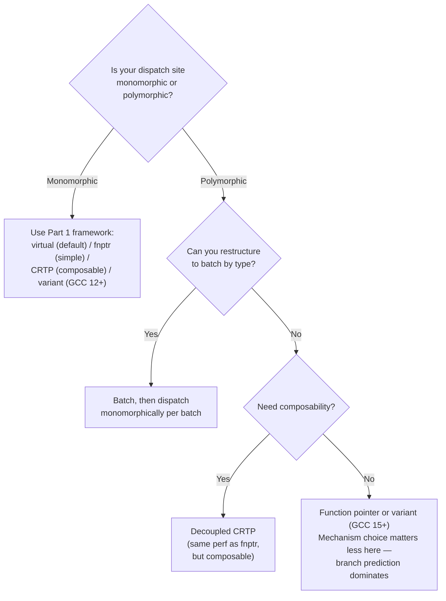

Every dispatch benchmark I've seen -- including [the ones I wrote]() -- tests the same thing: pick one implementation, call it a hundred million times, report the winner.

The branch predictor learns the target on the first few iterations and predicts it perfectly for the remaining 99,999,990. That's the nicest possible scenario for indirect dispatch, and the least realistic one.

Real systems don't work that way. A JVM's garbage collector barrier fires on every heap write, and in a generational collector, the write pattern determines *which* barrier runs. An audio pipeline routes samples through different effects depending on frequency band. A network stack selects protocol handlers based on packet headers. In every case, the hot loop sees a mix of concrete types, and the dispatch mechanism has to cope with targets that change from call to call.

This post measures what happens when you take the four mechanisms from [Part 1]() -- virtual dispatch, function pointer, `std::variant + std::visit`, and decoupled CRTP (a compile-time template pattern that [resolves to a cached function pointer]() at runtime) -- and feed them polymorphic workloads: round-robin, weighted random, and uniform random. The results change the decision framework.

## Setup

Same hardware as the rest of the series: Intel Xeon Gold 6130 @ 2.10 GHz. Two compilers: GCC 11.4.0 and GCC 15.2.0 (the bookends from [Part 4]()). Same flags: `-O2 -march=skylake-avx512 -fcf-protection -falign-functions=64 -falign-loops=64`.

Each benchmark pre-generates a pattern array of 1M plugin indices (Epsilon=0, Serial=1, G1=2) before timing begins. The hot loop walks this array, dispatching to whichever plugin the index selects, for 100M total iterations. Here's the virtual dispatch version -- the others are structurally identical:

```cpp
BarrierSet* plugins[3] = { &epsilon, &serial, &g1 };
auto pattern = make_pattern(pattern_name);  // 1M entries, pre-generated

for (long i = 0; i < 100'000'000L; ++i)
    plugins[pattern[i % 1'000'000]]->store(
        heap + (i % 64), static_cast<int>(i));
```

No allocation, no branching on the pattern itself. Just the dispatch mechanism under test.

Three workloads, each with a different degree of branch predictor friendliness:

- **Round-robin**: Epsilon, Serial, G1, Epsilon, Serial, G1, ... A perfectly periodic pattern with period 3. The branch predictor can learn this.
- **Weighted 90/10**: 90% G1, 10% Serial, randomly distributed. Close to a realistic JVM workload where most writes hit the generational barrier but some go through a simpler path.
- **Uniform random**: Equal probability of Epsilon, Serial, or G1 on each call. Pure chaos for the branch predictor.

For reference, here are the monomorphic baselines from Parts 1 and 4 (G1 plugin, 100M calls to the same target):

| Mechanism | GCC 11 (ns/call) | GCC 15 (ns/call) |
|-----------|-------------------|-------------------|
| Direct call (baseline) | 1.48 | 1.44 |
| Virtual dispatch | 2.90 | 2.42 |
| Function pointer | 2.43 | 2.42 |
| std::variant + std::visit | 3.71 | 1.47 |
| Decoupled CRTP | 2.42 | 2.41 |

Now let's see what happens when the target changes.

## Round-Robin: The Learnable Pattern

| Mechanism | GCC 11 (ns/call) | GCC 15 (ns/call) |
|-----------|-------------------|-------------------|
| Virtual dispatch | 3.05 | 3.05 |
| Function pointer | 2.88 | 2.88 |
| std::variant + std::visit | 4.65 | 2.24 |
| Decoupled CRTP | 2.87 | 2.88 |

Round-robin is the gentlest polymorphic pattern. The target cycles through three values with perfect periodicity, and modern branch predictors handle repeating patterns well. The CPU can learn the sequence and predict each indirect branch correctly most of the time.

Two things jump out immediately.

First, **CRTP and function pointer are identical**. Not close. Identical. 2.87 vs 2.88 on GCC 11, 2.88 vs 2.88 on GCC 15. This is the design prediction from Part 2 playing out: after lazy resolution, decoupled CRTP collapses to a function pointer array. Under monomorphic dispatch, the two mechanisms looked similar but could have diverged due to code layout or alignment effects. Under polymorphic dispatch, they converge exactly. The function pointer *is* the dispatch mechanism in both cases; CRTP just gave you composability on top.

Second, **variant on GCC 15 is the fastest indirect mechanism at 2.24 ns**. That's faster than function pointer (2.88 ns) and faster than virtual (3.05 ns). The switch-based `std::visit` from GCC 12+ generates a `switch` on the variant index, which the compiler lowers to a jump table. For a repeating three-element pattern, the CPU's indirect branch predictor handles this jump table better than a function pointer call -- the jump target is predictable, and the switch structure gives the optimizer more to work with than an opaque indirect call.

Why does the switch outperform a function pointer here? Under monomorphic dispatch in Part 4, the compiler hoisted the switch out of the loop entirely -- one check, then a tight loop body with no dispatch at all. Under round-robin, the switch has to execute on every iteration (the variant index changes), but the jump table targets are still direct jumps within the same function. A function pointer call is an indirect `call` instruction: push return address, jump to an unknown location. A jump table hit is an indirect `jmp` within a known function. The branch predictor treats these differently, and for a short repeating pattern, the jump table wins.

On GCC 11, variant is worst in class at 4.65 ns. The old function-pointer-table `std::visit` implementation stacks two overheads: the lambda capture round-trip from [Part 3]() and the new cost of cycling through three different dispatch targets. The vtable-style implementation was already slower for one target; now it's dispatching through three.

Virtual dispatch shows a mild increase from its monomorphic baseline (2.90 to 3.05 on GCC 11), but not much. The assembly tells us why. Here's the monomorphic hot loop from Part 1 next to the polymorphic version, both GCC 15:

```nasm
; MONOMORPHIC (Part 1): one plugin, called 100M times
  movq   8(%rsp), %rdi          ; load the same BarrierSet* every time
  movq   (%rdi), %rax           ; vptr (same address every iteration)
  movl   %ebx, %edx             ; value argument
  call   *16(%rax)              ; vtable[2] (same target every iteration)
  incq   %rbx
  cmpq   $100000000, %rbx
  jne    loop                   ; 7 instructions per iteration
```

```nasm
; POLYMORPHIC (Part 5): plugin changes every iteration
  mov    %r15,%rax              ; rax = i
  mul    %r12                   ; 128-bit multiply for i % 1'000'000
  ; ... 4 instructions computing remainder ...
  movslq (%rbp,%rax,4),%rax    ; load pat[i % PATTERN_SIZE]
  mov    (%rbp,%rax,8),%rdi    ; rdi = plugins[pat[...]] (different object each time)
  lea    (%rbx,%rax,4),%rsi    ; rsi = &heap[i % 64]
  mov    (%rdi),%rax           ; vptr (DIFFERENT address each iteration)
  call   *0x10(%rax)           ; vtable[2] (DIFFERENT target each iteration)
  cmp    $0x5f5e100,%r15
  jne    loop                  ; 11+ instructions per iteration
```

The vtable lookup is identical in both cases: load vptr, indirect call through vtable entry. What changes is everything before it. The monomorphic version loads one known pointer from the stack. The polymorphic version chases two extra indirections: one into the pattern array, one into the plugins array. More importantly, the branch predictor now sees a different `call *` target every three iterations instead of the same one. A period-3 pattern is easy enough to predict, so the cost stays modest.

## Weighted 90/10: The Realistic Workload

| Mechanism | GCC 11 (ns/call) | GCC 15 (ns/call) |
|-----------|-------------------|-------------------|
| Virtual dispatch | 5.60 | 5.58 |
| Function pointer | 4.67 | 4.63 |
| std::variant + std::visit | 7.08 | 4.31 |
| Decoupled CRTP | 4.65 | 4.63 |

This is the workload that most resembles production. 90% of calls hit G1 (the heavyweight barrier with pre and post barriers), and 10% hit Serial (post-barrier only). The distribution is random, seeded deterministically -- so the branch predictor can't learn a repeating pattern, but it *can* learn the dominant target and take its chances.

The numbers are significantly higher across the board. Virtual dispatch nearly doubled from its round-robin number (3.05 to 5.58 on GCC 15). Function pointer and CRTP jumped from 2.88 to 4.63. The misprediction penalty is real: when the predictor guesses G1 (which is correct 90% of the time), the 10% Serial calls cause pipeline flushes that cost 15-20 cycles each on Skylake.

To put that in perspective: even at a 10% misprediction rate, those flushes dominate the total cost. On Skylake, a correctly predicted indirect call takes on the order of 1 ns, while a mispredicted one costs roughly 15-20 cycles ([Agner Fog's microarchitecture guide](https://www.agner.org/optimize/microarchitecture.pdf), Table 3.16). At 2.1 GHz, that's 7-10 ns per mispredict. So 90% of calls are cheap and 10% are expensive, and the expensive ones dominate the average -- which is roughly the gap between the monomorphic and weighted numbers.

CRTP and function pointer remain locked together: 4.65 vs 4.67 on GCC 11, 4.63 vs 4.63 on GCC 15. At this point, treating them as distinct mechanisms is misleading. They *are* the same mechanism. CRTP is the source-level abstraction; function pointer is the runtime reality.

Virtual dispatch pays a consistent premium over function pointer: about 1 ns on both compilers. The vtable indirection (two dependent loads instead of one indirect call) translates to one extra cache access per dispatch, and that cost persists regardless of misprediction rate. Under monomorphic dispatch this gap was smaller (0.47 ns on GCC 11) because perfect prediction hid some of the latency. Under polymorphic dispatch, the mispredictions amplify the structural cost.

Variant on GCC 15 (4.31 ns) beats function pointer (4.63 ns) again, though the gap has narrowed from the round-robin case. The switch-based dispatch still gives the optimizer an edge, but random arrival order makes the jump table harder to predict than the repeating pattern did.

Variant on GCC 11 (7.08 ns) is worst in class by a wide margin. It stacks the old `std::visit` overhead on top of the misprediction penalty. If you're on GCC 11 and your workload is polymorphic, variant is the wrong choice.

## Uniform Random: The Worst Case

| Mechanism | GCC 11 (ns/call) | GCC 15 (ns/call) |
|-----------|-------------------|-------------------|
| Virtual dispatch | 17.61 | 17.57 |
| Function pointer | 14.11 | 14.15 |
| std::variant + std::visit | 18.89 | 13.95 |
| Decoupled CRTP | 14.11 | 14.15 |

Every call is a coin flip among three options, equally weighted. The branch predictor has no pattern to learn, no dominant target to bet on. A naive "predict last target" strategy would miss one in three, but modern predictors (TAGE and similar) do slightly better by tracking deeper history. The actual miss rate, measured below, lands at 22%.

`perf stat` confirms this. Here are the hardware counters for the random pattern on GCC 15, alongside monomorphic baselines:

| Mechanism | ns/call | Branch miss rate | IPC | Instructions |
|-----------|---------|-----------------|-----|--------------|
| Virtual (random) | 17.55 | 22.0% | 0.58 | 10.8B |
| FnPtr (random) | 14.15 | 22.0% | 0.66 | 9.8B |
| Variant (random) | 13.95 | 23.5% | 0.66 | 9.6B |
| CRTP (random) | 14.15 | 22.0% | 0.66 | 9.8B |
| Virtual (mono) | 2.42 | 0.00% | 3.18 | 1.6B |
| Variant (mono) | 1.47 | 0.01% | 3.00 | 0.9B |

The branch miss rate is ~22% across all four mechanisms under random dispatch, consistent with a predictor that guesses the most recent target and misses roughly one in three. IPC collapses from 3.0-3.2 (monomorphic) to 0.6 (random). The CPU spends most of its time waiting for mispredicted branches to resolve rather than executing useful work.

The numbers are striking. Function pointer went from 2.88 ns (round-robin) to 14.15 ns (random), a 4.9x increase. Virtual went from 3.05 to 17.57, a 5.8x increase. These are not dispatch overhead numbers anymore; they're branch misprediction numbers. The dispatch mechanism is a rounding error compared to the cost of guessing wrong.

But the relative order still matters.

CRTP and function pointer: 14.11 and 14.11 on GCC 11, 14.15 and 14.15 on GCC 15. Perfectly identical under maximum stress. They always were the same mechanism. Random dispatch just makes it undeniable.

Virtual dispatch adds 3.4 ns over function pointer (17.57 vs 14.15 on GCC 15). That's the same ~1 ns structural cost from the vtable indirection, amplified by the higher misprediction rate. When the predictor guesses wrong, the penalty includes flushing speculative work that started from the vtable lookup -- a longer pipeline to drain.

**Variant on GCC 11 is the worst number in the entire series: 18.89 ns.** The old vtable-based `std::visit` adds its own indirection layer on top of the misprediction chaos. On GCC 15, variant drops to 13.95 ns -- now matching (and slightly beating) function pointer at 14.15 ns. The switch optimization doesn't just help under monomorphic dispatch. Under maximum polymorphic stress, it transforms variant from worst-in-class to competitive-with-best.

Random dispatch is the great equalizer. When the CPU can't predict the branch, what matters is the depth of the dependency chain between the mispredicted branch and the correct target address.

A function pointer loads one address and jumps. Virtual dispatch chains two dependent loads (vptr, then vtable entry) before it can jump. On GCC 11, variant stacks even more work: build a lambda capture struct, index into a function pointer table, then indirect-call through it. GCC 15's switch collapses that back to a single jump table lookup within the same function.

Misprediction amplifies these differences. When the CPU discards speculative work after a wrong prediction, recovery time scales with how much setup the correct path requires before reaching the target. Virtual dispatch (17.57 ns) pays a consistent 3.4 ns premium over function pointer (14.15 ns) because the vtable indirection adds one more dependent load to the recovery path.

## The Full Picture

Here are all the numbers in one place. All values in ns/call.

**GCC 11.4.0:**

| Mechanism | Monomorphic | Round-robin | Weighted 90/10 | Random | Degradation |
|-----------|-------------|-------------|----------------|--------|-------------|
| Virtual | 2.90 | 3.05 | 5.60 | 17.61 | 6.1x |
| FnPtr | 2.43 | 2.88 | 4.67 | 14.11 | 5.8x |
| Variant | 3.71 | 4.65 | 7.08 | 18.89 | 5.1x |
| CRTP | 2.42 | 2.87 | 4.65 | 14.11 | 5.8x |

**GCC 15.2.0:**

| Mechanism | Monomorphic | Round-robin | Weighted 90/10 | Random | Degradation |
|-----------|-------------|-------------|----------------|--------|-------------|
| Virtual | 2.42 | 3.05 | 5.58 | 17.57 | 7.3x |
| FnPtr | 2.42 | 2.88 | 4.63 | 14.15 | 5.8x |
| Variant | 1.47 | 2.24 | 4.31 | 13.95 | 9.5x |
| CRTP | 2.41 | 2.88 | 4.63 | 14.15 | 5.9x |

*Degradation = Random / Monomorphic ratio.*

The clearest finding is what happened to variant. The GCC 12+ switch optimization doesn't just help monomorphic dispatch; it restructures how variant fails under polymorphism. On GCC 15, variant drops from 4.65 to 2.24 ns under round-robin (52% faster) and from 18.89 to 13.95 ns under random. It goes from worst-in-class on GCC 11 to best-in-class on GCC 15 at every workload.

CRTP and function pointer, meanwhile, are provably the same mechanism. They land at identical numbers in every single measurement across all three workloads and both compilers. Under polymorphic dispatch, [lazy resolution]() collapses to a function pointer array. If you don't need composable barrier layers, a raw function pointer gives you the same runtime performance with less code.

Virtual dispatch barely benefits from GCC 15. The vtable indirection is the bottleneck, and compiler upgrades can't optimize it away. Virtual went from 2.90 to 2.42 ns in the monomorphic case (alignment and codegen improvements), but under random dispatch the improvement vanishes: 17.61 vs 17.57.

Finally, the degradation ratios deserve attention. All mechanisms see 5-7x slowdown from monomorphic to random, but variant's 9.5x ratio (1.47 to 13.95 on GCC 15) stands out. The monomorphic number was artificially good because the compiler [hoisted the switch out of the loop entirely](). Under polymorphic dispatch that optimization disappears. The monomorphic number was the outlier, not the polymorphic one.

### Updated Decision Framework

Part 1's [flowchart]() asked about extensibility and composability. Polymorphic dispatch adds one question at the top:



If your hot loop always dispatches to the same type, the Part 1-4 framework holds and mechanism choice matters. If your loop mixes types, the gap between fastest and slowest shrinks from 2.5x (monomorphic, GCC 11) to 1.3x (random, GCC 15). The branch predictor dominates, and all four mechanisms degrade roughly together.

### When You Can Restructure

The biggest win for polymorphic dispatch isn't picking a faster mechanism. It's reducing how often the branch predictor has to guess. If your loop dispatches to different plugin types in an unpredictable order, consider sorting or grouping by type before dispatching:

```cpp
// Before: mixed dispatch, branch predictor thrashes
for (auto& item : items)
    plugins[item.type]->process(item);

// After: batch by type, each inner loop is monomorphic
std::sort(items.begin(), items.end(),
          [](auto& a, auto& b) { return a.type < b.type; });
for (auto& item : items)
    plugins[item.type]->process(item);  // same target for long runs
```

The sort costs O(N log N) once, but the inner loop now hits the same branch target for each batch of consecutive same-type items. For large N with a small number of types, this can recover most of the monomorphic performance. Whether the sort is worth it depends on your N, your type count, and how expensive each `process` call is relative to the sort overhead.

### Limitations

These benchmarks used 3 plugin types. Three is the minimum for meaningful polymorphism, but real systems may have 8, 15, or more. With more types, the branch miss rate climbs higher (the predictor has more targets to track), and the mechanisms may diverge further. The relative ranking should hold, but the absolute numbers will be worse.

---

*Benchmarks run on Intel Xeon Gold 6130 @ 2.10 GHz. GCC 11.4.0 and GCC 15.2.0 (conda-forge, statically linked). Flags: `-O2 -march=skylake-avx512 -fcf-protection -falign-functions=64 -falign-loops=64`. 100M iterations per measurement, 1M warmup, best of 5 runs. Pattern array: 1M entries, pre-generated before timing. PRNG seed: 42. Benchmark source: [cpp-dispatch-benchmark](https://github.com/Shubhankar-Gambhir/cpp-dispatch-benchmark).*

*Previously: [Your Stdlib Implementation Matters More Than the Dispatch Pattern]()*
